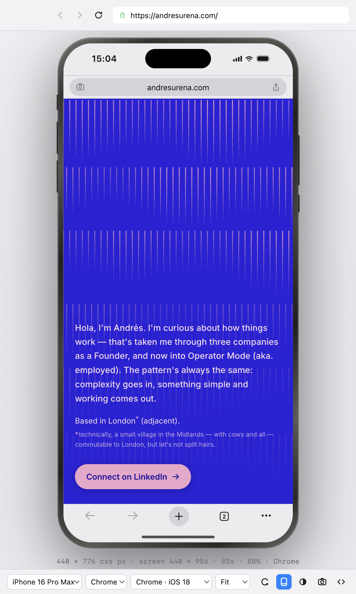
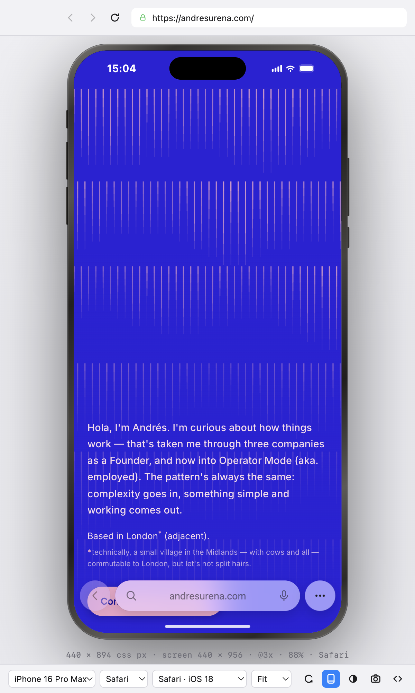
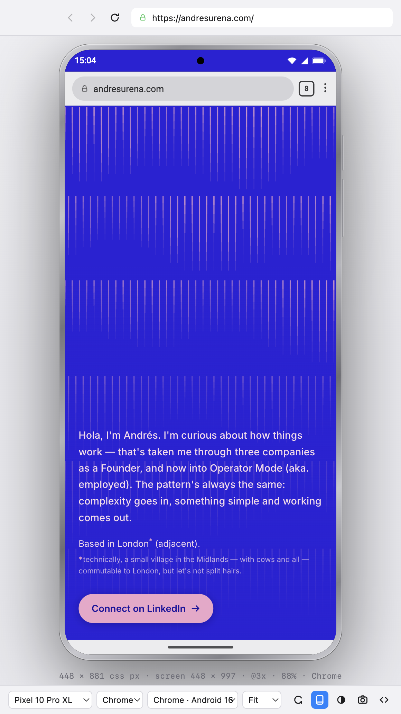

# iPhone Browser

**A native Mac app that behaves like the browser on your phone.**

This probably exists already. But every version I found was buried inside
Developer Tools, or meant syncing through iPhone Mirroring — which doesn't
always work. I wanted something simpler: a small Chromium browser where I can
check the sites and projects I'm building on a phone-shaped screen, without the
ceremony.

So I built it. It's massively simple (and it was fun). Open sourcing it to all.



It isn't a mockup with a screenshot inside it. It's a live browser running under
the same device-emulation engine Chrome DevTools uses, so the viewport, pixel
ratio, touch events, safe-area insets and user agent all behave like the real
device.

## Requirements

- macOS, Apple Silicon or Intel — the build produces a universal binary.
- [Xcode Command Line Tools](https://developer.apple.com/xcode/resources/) —
  `xcode-select --install`. Needed for the native-module rebuild step
  `electron-builder` runs; without it `npm run dist` fails with a compiler
  error rather than a clear message.
- Node 18 or later.

## Running it

```bash
npm install
npm start
```

To get an actual app you can keep in your Dock:

```bash
npm run install-app
```

That builds it and puts `iPhone Browser.app` in /Applications, quitting and
replacing any copy already there — so the same command is also how you update
it after pulling changes. Building it yourself means macOS treats it as a local
app and opens it without any Gatekeeper complaints.

`npm run dist` builds without installing, leaving the app in
`dist/mac-universal/`.

## What it emulates

Measured from the running app on an iPhone 16 Pro Max:

| | value |
|---|---|
| Viewport · Chrome for iOS | 440 × 776 CSS px |
| Viewport · Safari (iOS 26) | 440 × 894 CSS px |
| Viewport · Vivaldi | 440 × 768 CSS px |
| Viewport · no browser UI | 440 × 956 CSS px |
| Landscape | 838 × 392 CSS px |
| `window.screen` | 440 × 956 |
| `devicePixelRatio` | 3 |
| Touch | `ontouchstart`, `maxTouchPoints: 5`, mouse drags become touch drags |
| Media queries | `pointer: coarse`, `hover: none` |
| `env(safe-area-inset-*)` | real — 62/0/34/0 fullscreen, 0/0/88/0 under Safari's floating bar |
| Page with no `<meta viewport>` | falls back to a 980 px layout, like a real phone |

## Controls

Top bar: back, forward, reload, address field. Below it, a tab strip.
Bottom bar: device, display (foldables only), browser, zoom — menus that open
upward from the bar — then rotate / browser UI / colour scheme / screenshot /
Settings.

The window opens the full height of your screen, menu bar to Dock, and stays
the size you leave it; switching device no longer resizes it.

The mouse acts as a finger only while it's over a page. Move off the phone and
it's an ordinary pointer again, so the app's own controls behave normally.

| | |
|---|---|
| ⌘L | focus the address field |
| ⌘T | new tab |
| ⌘R / ⌘⇧R | reload / reload ignoring cache |
| ⌘[ / ⌘] | back / forward |
| ⌘⌃R | rotate |
| ⌘⇧B | show or hide the browser interface |
| ⌘/ | show or hide the technical readout (viewport, DPR, zoom) |
| ⌘0 … ⌘4 | zoom: fit, 100%, 85%, 75%, 50% |
| ⌘⇧1 … ⌘⇧8 | switch device |
| ⌘S / ⌘⇧S | screenshot / full-page screenshot to the Desktop |
| ⌘, | Settings |
| ⌘⌥I | Web Inspector for the page |
| ⌘⌥⇧I | inspect the app's own UI |

Type `3000` in the address field to open `http://localhost:3000`, or
`localhost:5173/some/path`. Anything without a dot becomes a search.

Screenshots go to the Desktop at true device resolution — 1320 × 2868 physical
pixels for a full iPhone 16 Pro Max screen, not your Mac's scale factor.
⌥-click the camera (or ⌘⇧S) to capture the whole scrollable page.

Self-signed certificates on `localhost`, `*.local` and private LAN addresses are
accepted automatically, so an HTTPS dev server just works.

The `440 × 776 css px · @3x · 91% · Chrome` readout under the phone is off by
default — most people don't need it. Turn it on from **View → Show Technical
Info** (⌘/) when you want the exact numbers.

## Tabs

Up to **4 tabs**, in the strip below the address bar — not inside the
simulated phone itself. All tabs share whatever device, browser skin,
orientation and colour scheme you've selected; switching tabs only changes
which page is showing.

The cap is deliberate, not arbitrary: each tab is a full, separate Chromium
process with its own live CDP session driving continuous device emulation.
That's real weight per tab, and 4 is where the app stays fast and stable
without turning into a general-purpose many-tab browser. Try to open a 5th and
the app tells you so, right there.

## Settings

The gear at the bottom right, or ⌘,.

- **General** — Start at Login; Start with last simulator used (or always open on
  a device you pick); Advanced Mode.
- **Devices** and **Browsers** — choose which appear in the menus. The last one
  left on can't be switched off.
- **About**

**Advanced Mode** adds the Profile menu, for sending a different user agent from
the browser you picked, and the Web Inspector button. Without it the user agent
simply follows the browser — Safari sends Safari's, Chrome sends Chrome's.

## Devices

| Device | Viewport | DPR |
|---|---|---|
| iPhone Duo — Outer | 466 × 678 | 3 |
| iPhone Duo — Inner (and partially folded) | 626 × 890 | 3 |
| iPhone Duo — Split View, each app | 437 × 626 | 3 |
| iPhone 17 Pro Max | 440 × 956 | 3 |
| iPhone 16 Pro Max | 440 × 956 | 3 |
| iPhone 16 Pro | 402 × 874 | 3 |
| iPhone 16 Plus | 430 × 932 | 3 |
| iPhone 16 | 393 × 852 | 3 |
| iPhone 15 Pro Max | 430 × 932 | 3 |
| Pixel 10 Pro XL | 448 × 997 | 3 |
| Pixel 10 Pro | 427 × 952 | 3 |

Every viewport except the Duo's matches Chrome DevTools' own device list, so a
page measured here measures the same in DevTools' device toolbar. DevTools has
no iPhone Duo preset yet — these come from Apple's panel sizes.

### iPhone Duo

One device, with a **Display** menu beside it: Outer · Inner · Inner, partially
folded · Split View with your page on the left · Split View with it on the right.
Rotate works on every one of them.

The outer display is the one that catches layouts out. At 466 × 678 it's **wider
and shorter than any other iPhone**, and iOS runs the status bar, toolbar and tab
bar down the trailing edge instead of across the top and bottom — so a page there
gets an asymmetric safe area, the opposite of what phone layouts usually assume.
The inner display does the same in landscape and keeps ordinary bars in portrait.

What's drawn follows Apple's own diagrams: a round camera in the corner, which
moves to the bottom-right when you turn the device; the time and a single
Wi-Fi/signal/battery glyph beneath it; toolbar buttons at the top of the rail with
grouped items sharing one capsule; the tab bar at the foot. When the rail runs
short, toolbar items fold into "…" first and the tab bar collapses after, as the
guidelines describe.

**Split View** draws both apps — two rounded windows either side of a divider —
and the other half is your second tab, live. Click into it and it becomes the tab
you're working in; neither page moves. Each app keeps its controls on its own
outer edge, so the left app's rail is on the left. **Partially folded** shows
where the crease lands on your layout.

**Poses · Beta** — the same displays drawn in three dimensions, the way
Apple's device-poses diagram shows the phone held or set down: *Book, half
open* (the left half swung toward you), *Laptop, on a surface* (the top half
leaning back, the base lying flat, as Netflix uses it for playback controls)
and *Tent, standing* (the outer display leaning back on an A-frame, the inner
display lighting the surface in the page's own colour, as the alarm clock
does). The half you're looking at is the live page — you can still scroll and
click it — and the half turned away is a picture of the page that refreshes as
it scrolls and loads. Nothing about the emulation changes in a pose: a site
gets exactly what it gets on the flat display, because Safari gives it no way
to know the phone is folded. Beta because Apple has published nothing about
web content in any pose; the angles are matched to its illustrations.

Two caveats. Safari ships **no fold-detection API** — CSS Viewport Segments
(`env(viewport-segment-*)`) is Chromium-only — so a page can't tell folded from
flat, which is why the crease is only drawn, never reported. And the device isn't
out until 23 October 2026: the panel sizes and control placement are Apple's, but
the insets, rail spacing and divider width are measured off its diagrams, not
hardware. They're collected in `DUO_RAIL` in `src/shell/duo.js`, to correct once
it ships.

## Browser interfaces

The interface you pick changes the drawn chrome *and* how much screen the page
gets — which is the point, because they genuinely differ:

| Interface | Chrome it draws | Viewport (16 Pro Max) |
|---|---|---|
| **Chrome** (iOS, default) | omnibox on top, toolbar below | 440 × 776 |
| **Safari** (iOS 26) | floating glass capsule the page scrolls under | 440 × 894 |
| **Vivaldi** (iOS) | search field + toolbar stack | 440 × 768 |
| **Chrome** (Android) | omnibox on top, gesture strip below | 448 × 881 on a Pixel |

Pick an Android device and the interface and user agent switch to Chrome for
Android automatically, and back again for an iPhone. The user agent stays
overridable on its own if you want an odd combination.

One thing that looks like a bug and isn't: every iOS user agent here still says
`iPhone OS 18_6`. Apple froze that token at the last iOS 18 release when iOS 26
shipped, so a real iPhone on iOS 26 reports it too — only `Version/` tracks
Safari. Chrome does the same on Android, pinning every device to
`Android 10; K` whatever it really is. Sniffing the OS or the model out of a
user agent stopped working on purpose, and you can see that here.

Safari and Chrome for Android tint the status bar from the page's
`theme-color`, like the real ones do. Chrome and Vivaldi on iOS colour it from
their own toolbar instead, which is also what the real ones do.

<p align="center">
  
  
</p>

## Adding a device

Everything lives in [`src/devices.js`](src/devices.js) — copy a block, change
the numbers. The picker, the menu and the drawn frame all read from it, and the
frame is drawn in CSS so it scales to whatever size you give it.

Browser bar heights live in [`src/browsers.js`](src/browsers.js). These are
close approximations of the shipping apps; if a vendor moves something in a
later release, edit those numbers rather than the layout code.

## Known limitations

- **It is Chromium, not WebKit.** The layout engine, JS engine and CSS support
  are Chrome's. Setting the user agent to Safari changes what servers and
  UA-sniffing scripts see, not how the page is actually rendered. For genuine
  WebKit rendering bugs you still want Safari's own responsive design mode or a
  real device. This app is for layout, breakpoints, safe areas and touch flows.
- The browser UI is a drawing, not a browser. The address pill, share and tab
  buttons are decorative; back, forward and reload in them do work.
- Safari's iOS 26 floating bar is modelled as an overlay that reserves no layout
  space and reports its footprint as `safe-area-inset-bottom`. That matches the
  design intent; the exact height a shipping iOS build reports may drift.
- Landscape chrome is simplified to a single top bar for Vivaldi.
- Browsers on iOS are all WebKit underneath and don't advertise themselves, so
  the iOS skins send Safari-family user agents.
- Status bar readings — signal, Wi-Fi, battery — are drawn full. They're
  furniture, not live system state. The clock is real.
- Opening the Web Inspector briefly suspends touch emulation, because DevTools
  and the emulation share one debugging channel. It's restored when you close it.

## How it works

- `src/main.js` — Electron main process. Owns the window, applies emulation over
  the Chrome DevTools Protocol (`Emulation.setDeviceMetricsOverride`,
  `setTouchEmulationEnabled`, `setUserAgentOverride`,
  `setSafeAreaInsetsOverride`, `setEmulatedMedia`), takes screenshots via
  `Page.captureScreenshot`, and persists settings.
- `src/shell/` — the app's own UI: toolbar, the CSS device frame, and a
  `<webview>` holding the page. Emulation calls are serialised so two rapid
  setting changes can't land out of order.
- `src/devices.js` — the device and user-agent catalogue.
- `src/browsers.js` — the browser interface skins.
- `scripts/make-icon.js` — renders the app icon with Electron itself and packs
  it into `build/icon.icns`, so there's no image toolchain to install.

Built with [Claude Code](https://claude.com/claude-code).

## Licence

MIT — see [LICENSE](LICENSE). Do what you like with it.
